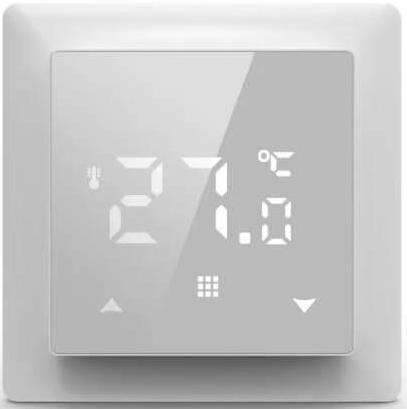
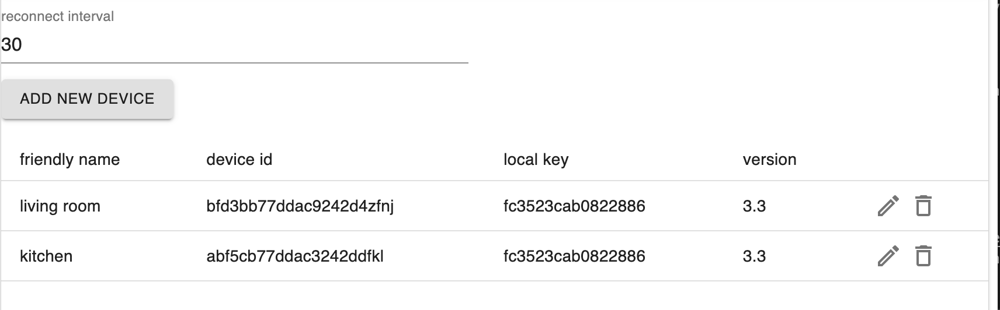

# ioBroker.siro-thermostat

**Tests:** 

## siro-thermostat adapter for ioBroker

This adapter allows you to integrate [WiFi Thermostats from SIRO](https://smart-life24.de/produktwelt/wlan-smart-raumthermostat-sl06116w/) into ioBroker.
Basically, it should be possible to integrate those devices with the tuya adapter.

tbh.. I did not try to use the tuya adapter, because it looked overkill for my usecase, so a new adapter was born :)

# Adapter Configuration

reconnect timeout: Define the time interval in seconds before the adapter tries to reconnect to a device, that was not able to connect initially or that lost connection inbeetween.

Devices:
You have to add your devices to the adapter manually,
therefore you have to insert the device id and local key. Version should always stay 3.3
Friendly name is for easy identification of your device.

see [how to extract local key](docs/how-to-extract-local-key.md)

**Hint**: If you reset your device (i.e. when changing your wifi settings) a new device id and local key is generated and your have to repeat the extraction.

### Some personal notes on this project

I was looking for thermostats for changing our existing ones for smart thermostats.
There had been some requirements that the new thermostats had to fulfill.
- Thermostats need to fit our existing frames (AS Jung series)
- Integratable to ioBroker without another kind of hardware (IoT hub/gateway)
- no cloud connection

The main reason for changing our existing thermostats is not primarily that I want to have smart ones.
Imho, there is no need for smart thermostats when using floor heating, BUT as our thermostats are so close
to light switches we often accidentily adjust the settings.

There is not a lot of choice when looking for thermostats with these requirements.

The ioBroker requirement is solved by creating this adapter. :) 
The "no cloud" requirement is solved using the cloud connection for initial device setup. After that is finished, you can block internet traffic in your firewall settings / router settings. Ofc, this part is optional. I prefer keeping the smart devices local only. There are other possibilites to control them over the internet like VPN.

## Changelog
For a detailed change log see [Changelog](CHANGELOG.md)

### **TODO FEATURES**
- change device settings
    - actual temperature compensation
    - limit max desired temperature
    - limit min desired temperature
    - default device state

### **Out of scope**
Currently it is not planned to support weekly programs using device native functions. We can make use of iobroker for that. Have a look at the calender adapter or implement scheduling yourself with the javascript adapter.

## Disclaimer
**All product and company names or logos are trademarks™ or registered® trademarks of their respective holders. Use of them does not imply any affiliation with or endorsement by them or any associated subsidiaries! This personal project is maintained in spare time and has no business goal.**

## License
MIT License

Copyright (c) 2022 steffen-brauer <steffen.brauer@mail.de>

Permission is hereby granted, free of charge, to any person obtaining a copy
of this software and associated documentation files (the "Software"), to deal
in the Software without restriction, including without limitation the rights
to use, copy, modify, merge, publish, distribute, sublicense, and/or sell
copies of the Software, and to permit persons to whom the Software is
furnished to do so, subject to the following conditions:

The above copyright notice and this permission notice shall be included in all
copies or substantial portions of the Software.

THE SOFTWARE IS PROVIDED "AS IS", WITHOUT WARRANTY OF ANY KIND, EXPRESS OR
IMPLIED, INCLUDING BUT NOT LIMITED TO THE WARRANTIES OF MERCHANTABILITY,
FITNESS FOR A PARTICULAR PURPOSE AND NONINFRINGEMENT. IN NO EVENT SHALL THE
AUTHORS OR COPYRIGHT HOLDERS BE LIABLE FOR ANY CLAIM, DAMAGES OR OTHER
LIABILITY, WHETHER IN AN ACTION OF CONTRACT, TORT OR OTHERWISE, ARISING FROM,
OUT OF OR IN CONNECTION WITH THE SOFTWARE OR THE USE OR OTHER DEALINGS IN THE
SOFTWARE.